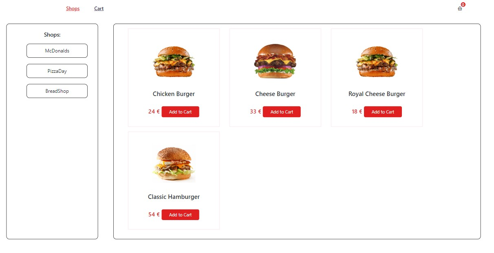
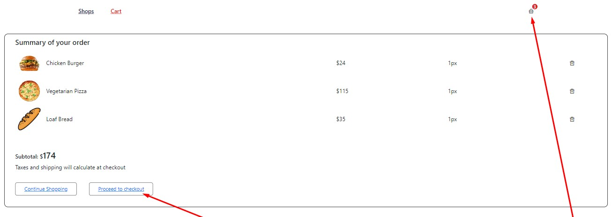
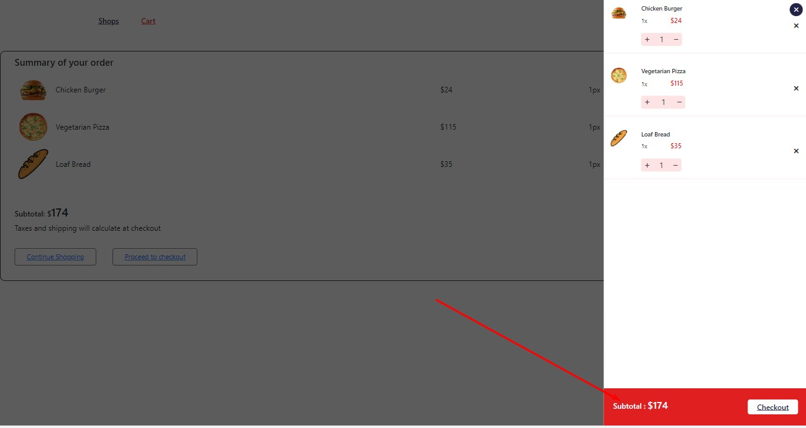
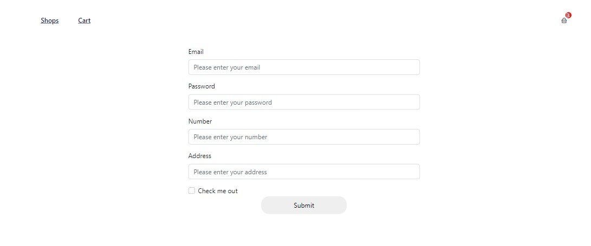
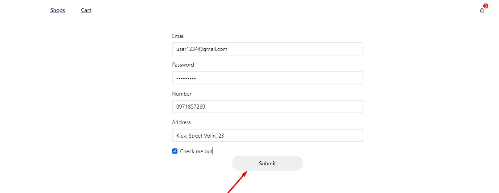
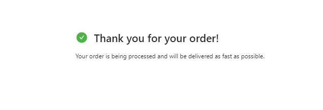

## Підготовка до роботи

1. Переконайтеся, що на комп'ютері встановлено LTS-версію Node.js. Скачай і
   встанови її, якщо необхідно.
2. Встанови базові залежності проекту командою npm install.
3. Запусти режим розробки, виконавши команду npm start.
4. Перейди у браузері за адресою http://localhost:3000. Ця сторінка автоматично
   перезавантажуватиметься після збереження змін у файлах проекту.

Вибираємо магазин і товари які нам до смаку і натискаємо Add to cart

Перейшовши на сторінку Cart можна подивитись загальну суму і оформити замовлення
або продовжити покупки

У верхньому правому кутку є бічне меню де також можна подивитись обрані
смаколики:)

Натискаємо Checkout

заповняємо поля для доставки і натискаємо кнопку submit

Після чого побачимо повідомлення про успішне офрмлення

